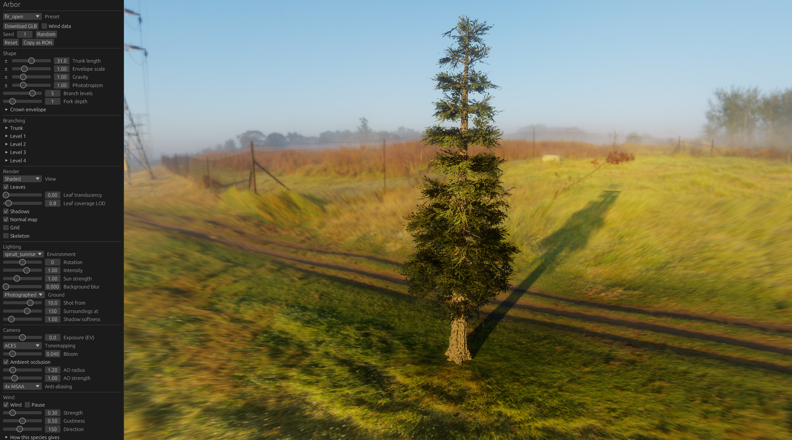

# Arbor

Procedural tree model generator in Rust. Aim is to generate ~7k-20k tri models.



Note, this application is almost entirely vibe-coded.

I didn't want to pay for SpeedTree.

## Layout

| Crate | What it is |
| --- | --- |
| `arbor-core` | The model: growth, meshing, foliage, cluster baking. No GL, no windowing. |
| `arbor-viewer` | An OpenGL viewer (eframe/egui + glow) with live parameter sliders. |
| `arbor-cli` | Grows a tree from the terminal, prints stats, optionally writes an OBJ or glTF. |

Species are plain RON files in `assets/species`, compiled in as the built-in
presets. Presets saved from the viewer's panel (**Save as**) go to
`assets/species/custom/<name>.ron`, are listed under *Saved* in the preset menu, and
are read from disk each time they are picked, so a hand edit shows up without a
rebuild. Both tools find them by name: `--species <name>` in the viewer,
`arbor-cli <name>` headless. Textures live in `assets/textures`, named `<key>_albedo.png`,
`_normal.png` and `_roughness.png`, with the key coming from the species
(`bark_texture: "bark_oak"`, `leaves.texture: "leaf_oak"`).

## Running it

The viewer reads textures from `assets/textures` relative to the working
directory, so run it from the repository root.

```bash
cargo run --release -p arbor-viewer
```

```bash
cargo run --release -p arbor-viewer
```

### Options:
`--species`, `--seed`, `--no-leaves`, `--wireframe`, `--no-shadows`,
`--translucency`, `--time`, `--sun-elevation`, `--sun-azimuth`,
`--sun-intensity`, `--yaw`, `--pitch`, `--distance`, `--target-y`,
`--coverage-lod`, `--wind <strength>`, `--gustiness`, `--wind-dir <degrees>`,
`--wind-time <seconds>`, and `--screenshot <path> [--settle N]`.

A screenshot is taken in still air unless `--wind` asks otherwise, and then on a
stopped clock (`--wind-time`, default 0), so the same command always gives the same
frame.

Headless, from the CLI:

```bash
cargo run --release -p arbor-cli -- oak --seed 7 --obj oak.obj
```

The OBJ comes out as triangles in two groups, `bark` and `leaves`, with leaf UVs
baked into their atlas cell (the viewer's shader picks a cell per card, an
exported mesh has no such shader).

## Exporting glTF

In the viewer, under **Save as**:

- **Export to** is the folder exports go to (`exports` by default, created if it's
  missing). Type a path or pick one with **Browse…**.
- **Variations** is how many trees to write: the one on screen, then the same species
  grown from each seed after its own.
- **Export GLB** / **Export glTF** write them, named as the preset would be saved:
  `<name>.glb` for one tree, `<name>_seed<N>.glb` for each of a batch, so any of them
  can be grown again from its seed. A batch shows its progress and can be stopped
  between trees.

From the CLI:

```bash
cargo run --release -p arbor-cli -- oak --seed 7 --glb oak.glb
```

```bash
cargo run --release -p arbor-cli -- oak --seed 7 --gltf out/oak.gltf --variations 10 --wind-data
```

The second writes `out/oak_seed7.gltf` through `out/oak_seed16.gltf`.

A `.glb` is one self-contained file. A `.gltf` is JSON, with its `.bin` and the
textures as `<name>_*.png` written beside it. A batch of `.gltf` files shares one set
of textures, since they're the species' rather than the tree's. Textures are
prepared once per export, however many trees it writes. Textures are read from
`assets/textures`; `--textures <dir>` reads them from somewhere else, and
`--no-textures` leaves them out.

The scene is a node named for the species with two children, `bark` and `leaves`,
in metres with Y up. The materials are standard metallic-roughness, set up to match
the viewer as closely as that allows:

- **Bark:** the species' bark maps, with its tint as the base colour factor and the
  darkening toward the foot of the trunk as a vertex colour (`COLOR_0`).
- **Dead wood:** its own material, with the viewer's bleaching baked into a copy of
  the bark albedo. Only a tree with dead wood the species bleaches has one.
- **Leaves:** the leaf art, or the cluster atlas baked from it, alpha-masked at the
  viewer's cutoff (0.35). Each card's tint and crown-depth shade go in `COLOR_0`.
  glTF can't choose a texture by which side of a card is seen, so a species whose
  leaves show a different cell from behind (the oak, the birch) gets a second,
  back-facing copy of every card. Species with one cell get single, double-sided
  cards.

Moss, light through the leaves, and the viewer's coverage-preserving leaf mipmaps
don't carry over. Expect distant canopies to thin a little in engines that build
ordinary mips.

`--wind-data` (the **Wind data** box in the viewer) adds what the viewer's wind shader
reads, as custom vertex attributes:

| Attribute | On | Holds |
| --- | --- | --- |
| `_WIND_1` | bark, leaves | Limb order: the pivot it bends about (xyz), and how far a point there swings per unit of flexibility, in metres (w). |
| `_WIND_2` | bark, leaves | The same for the branch order. |
| `_WIND_3` | bark, leaves | The same for twigs and everything finer. |
| `_LEAF_ORIGIN` | leaves | The twig point a card hangs from, which it flutters about. |

An order a vertex doesn't belong to has w = 0. The species' wind settings (flexibility
per order, frequency, flutter) go in the root node's `extras.arbor.wind`.

## Tools

```bash
cargo run --release -p arbor-core   --example morphology -- oak   # stem lengths, turn, children per level
cargo run --release -p arbor-core   --example budget     -- oak   # where the triangles go
cargo run --release -p arbor-core   --example levers     -- oak   # what each saving is actually worth
cargo run --release -p arbor-viewer --example preview    -- oak out.png
cargo run --release -p arbor-viewer --example bake_cluster -- leaf_oak
cargo run --release -p arbor-viewer --example import_textures -- leaf_oak --albedo src.png --alpha mask.png
cargo run --release -p arbor-viewer --example alpha_coverage_report -- assets/textures/leaf_oak_albedo.png
```

```bash
cargo test
```
