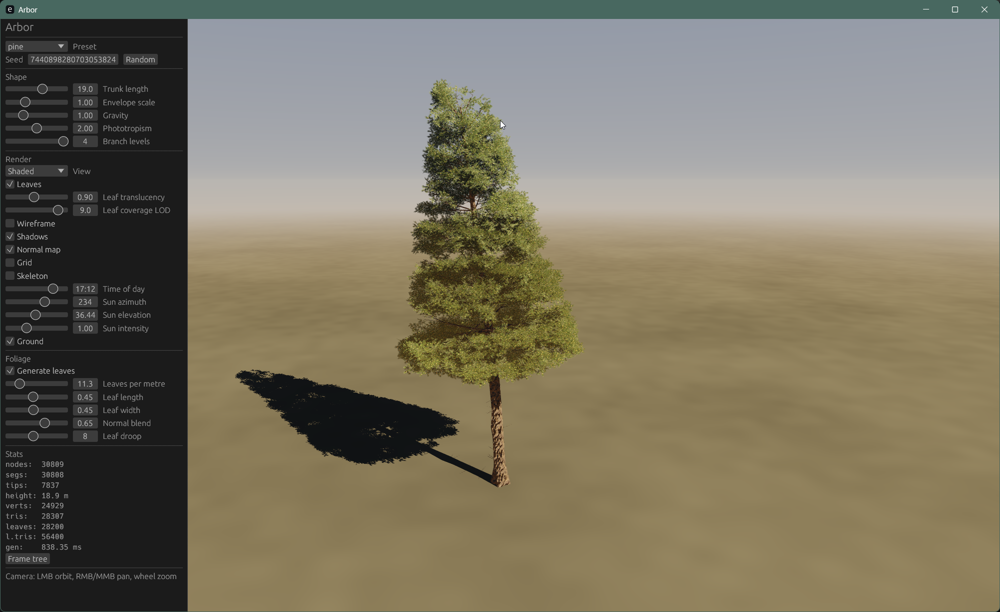

# Arbor

Procedural tree generation in Rust: a growth simulation that produces a branch
skeleton, a mesher that sweeps bark tubes over it, textured leaf cards for the
canopy, and a real-time viewer to tune it all in.



## Layout

| Crate | What it is |
| --- | --- |
| `arbor-core` | The model: growth, meshing, foliage, cluster baking. No GL, no windowing. |
| `arbor-viewer` | An OpenGL viewer (eframe/egui + glow) with live parameter sliders. |
| `arbor-cli` | Grows a tree from the terminal, prints stats, optionally writes an OBJ. |

Species are plain RON files in `assets/species`; `pine` and `oak` are compiled in
as presets. Textures live in `assets/textures`, named `<key>_albedo.png`,
`_normal.png` and `_roughness.png`, with the key coming from the species
(`bark_texture: "bark_oak"`, `leaves.texture: "leaf_oak"`).

## Running it

The viewer reads textures from `assets/textures` relative to the working
directory, so run it from the repository root.

```bash
cargo run --release -p arbor-viewer
```

It takes optional startup flags, which are also what a scripted capture uses:

```bash
cargo run --release -p arbor-viewer -- --species oak --seed 7 --time 17.2 --screenshot out.png
```

`--species`, `--seed`, `--no-leaves`, `--wireframe`, `--no-shadows`,
`--translucency`, `--time`, `--sun-elevation`, `--sun-azimuth`,
`--sun-intensity`, `--yaw`, `--pitch`, `--distance`, `--target-y`,
`--coverage-lod`, and `--screenshot <path> [--settle N]`.

Headless, from the CLI:

```bash
cargo run --release -p arbor-cli -- oak --seed 7 --obj oak.obj
```

The OBJ comes out as triangles in two groups, `bark` and `leaves`, with leaf UVs
baked into their atlas cell (the viewer's shader picks a cell per card, an
exported mesh has no such shader).

## The pipeline

1. **Growth** (`growth.rs`) walks stems segment by segment, each one nudged by
   phototropism, gravity, droop and a correlated random bend, and steered by a
   crown **envelope** (`envelope.rs`) that prunes anything growing outside the
   species' silhouette. Vigor decays with depth and decides who splits, who
   branches and who dies back. Output is a `Skeleton` of nodes carrying position,
   radius, level, vigor, and flags for dead and broken wood.
2. **Meshing** (`mesh.rs`) sweeps a tube along each run of segments. Side count
   comes from a silhouette tolerance in metres rather than a fixed number, so
   thick stems earn more sides and twigs earn fewer. The radius is a smooth
   function of angle and height — flutes, swelling, burls, knotholes, branch bark
   ridges, buttress roots at the foot — and normals are taken by finite
   difference of that function, so the detail shades correctly instead of
   faceting.
3. **Foliage** (`leaves.rs`) anchors alpha-tested quads along the last stretch of
   each twig. Card normals are blended toward the crown's outward direction,
   curved across the card and darkened toward the interior, which is what keeps a
   canopy from reading as a heap of flat planes.
4. **Cluster baking** (`cluster.rs`) composites a whole shoot of leaves into one
   atlas cell, so one card stands in for dozens of leaves at the same real-world
   leaf size. Fewer cards, better alpha coverage per quad. It runs in core, at
   load time, from the single-leaf art.

Rendering (`arbor-viewer`) adds a shadow pass, a physically-motivated sky whose
ambient is the dome projected into spherical harmonics, wrapped diffuse with
backlit transmission through leaves, and coverage-preserving mips so the canopy
does not thin out with distance.

## Tools

```bash
cargo run --release -p arbor-core   --example morphology -- oak   # stem lengths, turn, children per level
cargo run --release -p arbor-core   --example budget     -- oak   # where the triangles go
cargo run --release -p arbor-core   --example levers     -- oak   # what each saving is actually worth
cargo run --release -p arbor-viewer --example preview    -- oak out.png
cargo run --release -p arbor-viewer --example bake_cluster -- leaf_oak
cargo run --release -p arbor-viewer --example import_textures -- leaf_oak --albedo src.png --alpha mask.png
cargo run --release -p arbor-viewer --example alpha_coverage_report -- assets/textures/leaf_oak_albedo.png
```

`preview` is a small software rasteriser mirroring the viewer's shading, for
checking a tree from a script without a window.

```bash
cargo test
```

## Status

Wind parameters parse (`WindParams` in a species file) but nothing animates them
yet — foliage is static.
