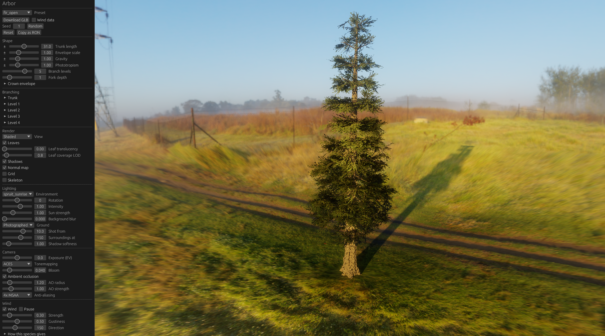

# Arbor

Procedural tree model generator in Rust. Aim is to generate ~7k-20k tri models.
It also makes the things that grow and lie around trees: ground cover (grasses,
wildflowers and ferns) and rocks.




Note, this application is almost entirely vibe-coded.

I didn't want to pay for SpeedTree.

## Layout

| Crate | What it is |
| --- | --- |
| `arbor-core` | The model: growth, meshing, foliage, cluster baking, ground cover, rocks. No GL, no windowing. |
| `arbor-render` | The OpenGL renderer as a library: PBR, shadows, image-based lighting, wind. Takes a `glow::Context`, no UI toolkit. |
| `arbor-viewer` | A viewer (eframe/egui) built on `arbor-render` with live parameter sliders. |
| `arbor-cli` | Grows a tree, a ground cover clump (`cover`) or a rock (`rock`) from the terminal, prints stats, optionally writes an OBJ or glTF. |

Species are plain RON files in `assets/species`, compiled in as the built-in
presets. Presets saved from the viewer's panel (**Save as**) go to
`assets/species/custom/<name>.ron`, are listed under *Saved* in the preset menu, and
are read from disk each time they are picked, so a hand edit shows up without a
rebuild. Both tools find them by name: `--species <name>` in the viewer,
`arbor-cli <name>` headless. Textures live in `assets/textures`, named `<key>_albedo.png`,
`_normal.png` and `_roughness.png`, with the key coming from the species
(`bark_texture: "bark_oak"`, `leaves.texture: "leaf_oak"`).

### Ranges

Any number in a species can be a range instead of a value, so a species describes a
kind of tree rather than one tree:

```ron
trunk: (
    length: (12.0, 18.0),
    ...
),
envelope_scale: (0.85, 1.15),
```

Each tree lands somewhere in each range, and its seed decides where: the same seed
always gives the same tree, and the next seed gives a different one. Each range is
drawn on its own, so adding a range to one number never moves where the others land.
This is not the same as `length_variance` and the other variances, which spread the
stems *within* one tree; a range is drawn once for the whole tree. A trunk-length
range also takes the crown envelope with it, which the trunk's `length_variance`
does not.

In the viewer, the **±** beside a slider turns it into a range with two handles, and
the second one reports where the tree on screen landed. Pressing **±** again folds the
range back to that value. Export **Variations** lands every range afresh for each
tree. The CLI prints each landing under the seed.

## Running it

The viewer reads textures from `assets/textures` relative to the working
directory, so run it from the repository root.

```bash
cargo run --release -p arbor-viewer
```

```bash
cargo run --release -p arbor-viewer
```

### Options:
`--species`, `--seed`, `--no-leaves`, `--wireframe`, `--no-shadows`,
`--translucency`, `--time`, `--sun-elevation`, `--sun-azimuth`,
`--sun-intensity`, `--sun-size <degrees>`, `--yaw`, `--pitch`, `--distance`,
`--target-y`, `--coverage-lod`, `--wind <strength>`, `--gustiness`,
`--wind-dir <degrees>`, `--wind-time <seconds>`, `--hdri <name|sky>`,
`--env-rotation <degrees>`, `--env-intensity`, `--ground <photo|plain|none>`,
`--blur <0..1>`, `--exposure <stops>`, `--tonemap <aces|agx|punchy|neutral>`,
`--bloom`, `--no-ao`, `--ao-radius <metres>`, `--softness`, `--msaa <samples>`,
`--view <uv|normals|ao>`, and `--screenshot <path> [--settle N]`.

Ground cover: `--cover <preset>` opens in ground cover mode, with the clump planted
over a field; `--cover-view <eye|far>` picks the eye-height or 45 m viewpoint,
`--field <metres>` the size of the field, and `--lod-tint` colours each clump by the
LOD its screen size picks (white, red, blue).

Rocks: `--rock <preset>` opens in rock mode, `--lod N` on its Nth LOD.

A screenshot is taken in still air unless `--wind` asks otherwise, and then on a
stopped clock (`--wind-time`, default 0), so the same command always gives the same
frame. Setting the sun by hand (`--time`, `--sun-elevation`, `--sun-azimuth`) picks
the procedural sky unless `--hdri` names a photograph as well.

### Lighting

The tree is lit by an environment, either a photographed one (an HDRI) or a sky
built from the time of day, and drawn the way an offline renderer would draw it:

- **Surfaces** use Filament's standard model: GGX, height-correlated Smith and
  Schlick for the specular, Lambert for the diffuse, with Filament's multiscatter
  DFG table putting back the energy single-scattering GGX loses on rough bark.
  Leaves are thin sheets that scatter light out of both faces, lit through from
  behind as well as from the front.
- **The environment** lights through a GGX-prefiltered cube map for reflections
  and spherical harmonics for everything else. A photograph's sun is found and
  lifted out of it, then put back as a light of the same energy, so it casts
  shadows and lights leaves from behind. Windows and lamps are told apart from a
  sun by whether they outshine the sky as a whole.
- **Shadows** soften with distance from what casts them (PCSS), by the sun's own
  size: crisp at the foot of the trunk, loose under the edge of the crown.
- **Occlusion** comes from the screen (GTAO) for forks, crevices and the inside
  of the crown, and from the crown seen from above for the sky a tree takes from
  the ground beneath it and from its own trunk.
- **The frame** is drawn in half-float with MSAA, bloomed, and tonemapped once at
  the end: ACES by default, or AgX (Blender's default), AgX Punchy, or Khronos
  PBR Neutral.

A photograph's ground is laid under the tree on a dome with a flat floor, as
three.js's grounded skybox does, so the tree stands on the ground in the picture,
catches its shadow there, and has what is far off standing up around it rather
than smeared flat. **Shot from** and **Surroundings at** set how high the
photograph was taken and how far off its surroundings stand; each bundled one
comes with its own. The **Occlusion** view shows the occlusion alone.

The photographs live in `assets/hdri`, and any `.hdr` put there is offered on the
desktop. The bundled ones are from [Poly Haven](https://polyhaven.com/hdris)
(CC0), brought in at 2048 wide with the import tool:

```bash
cargo run --release -p arbor-viewer --example import_hdri -- path/to/sky_4k.hdr --preview check.png
```

It reports the sun it finds, and `--preview` marks where, which is the quickest
way to see that a sun came from the sun and not a window.

Headless, from the CLI:

```bash
cargo run --release -p arbor-cli -- oak --seed 7 --obj oak.obj
```

The OBJ comes out as triangles in two groups, `bark` and `leaves`, with leaf UVs
baked into their atlas cell (the viewer's shader picks a cell per card, an
exported mesh has no such shader).

### In a browser

The viewer also builds for the web, on WebGL2:

```bash
bash crates/arbor-viewer/web/build.sh
python -m http.server 8080 -d docs
```

Then open http://localhost:8080. `docs/` is the whole site: the page, the wasm, the
texture maps the built-in species use (about 55 MB, most of it the spruce bark), and
the bundled environments (about 23 MB).
GitHub Pages serves it from the branch (**Settings → Pages → Deploy from a branch**,
folder `/docs`), and it works on any other static host.

The build needs the `wasm32-unknown-unknown` target and `wasm-bindgen-cli`. The CLI's
version has to match the `wasm-bindgen` crate in `Cargo.lock`, which
`cargo tree -p arbor-viewer --target wasm32-unknown-unknown -i wasm-bindgen` prints.

```bash
rustup target add wasm32-unknown-unknown
cargo install --locked wasm-bindgen-cli --version 0.2.126
```

On the web:

- Textures are fetched when a species is picked. Switching species holds the page
  for a moment while its leaf atlas is baked.
- Environments are fetched when picked too, 5–7 MB each. The procedural sky
  needs nothing fetched.
- **Download GLB** exports the tree on screen as a download. Batches, glTF and
  saving presets need the desktop viewer; **Copy as RON** works in both.
- There's no wireframe, because WebGL can't draw one.
- A seed grows the same tree as on the desktop. Only float noise differs, well under
  a millimetre.

## Exporting glTF

In the viewer, under **Save as**:

- **Export to** is the folder exports go to (`exports` by default, created if it's
  missing). Type a path or pick one with **Browse…**.
- **Variations** is how many trees to write: the one on screen, then the same species
  grown from each seed after its own.
- **Export GLB** / **Export glTF** write them, named as the preset would be saved:
  `<name>.glb` for one tree, `<name>_seed<N>.glb` for each of a batch, so any of them
  can be grown again from its seed. A batch shows its progress and can be stopped
  between trees.

From the CLI:

```bash
cargo run --release -p arbor-cli -- oak --seed 7 --glb oak.glb
```

```bash
cargo run --release -p arbor-cli -- oak --seed 7 --gltf out/oak.gltf --variations 10 --wind-data
```

The second writes `out/oak_seed7.gltf` through `out/oak_seed16.gltf`.

A `.glb` is one self-contained file. A `.gltf` is JSON, with its `.bin` and the
textures as `<name>_*.png` written beside it. A batch of `.gltf` files shares one set
of textures, since they're the species' rather than the tree's. Textures are
prepared once per export, however many trees it writes. Textures are read from
`assets/textures`; `--textures <dir>` reads them from somewhere else, and
`--no-textures` leaves them out.

The scene is a node named for the species with two children, `bark` and `leaves`,
in metres with Y up. The materials are standard metallic-roughness, set up to match
the viewer as closely as that allows:

- **Bark:** the species' bark maps, with its tint as the base colour factor and the
  darkening toward the foot of the trunk as a vertex colour (`COLOR_0`).
- **Dead wood:** its own material, with the viewer's bleaching baked into a copy of
  the bark albedo. Only a tree with dead wood the species bleaches has one.
- **Leaves:** the leaf art, or the cluster atlas baked from it, alpha-masked at the
  viewer's cutoff (0.35). Each card's tint and crown-depth shade go in `COLOR_0`.
  glTF can't choose a texture by which side of a card is seen, so a species whose
  leaves show a different cell from behind (the oak, the birch) gets a second,
  back-facing copy of every card. Species with one cell get single, double-sided
  cards.

Moss, light through the leaves, and the viewer's coverage-preserving leaf mipmaps
don't carry over. Expect distant canopies to thin a little in engines that build
ordinary mips.

`--wind-data` (the **Wind data** box in the viewer) adds what an engine needs to sway
the tree as the viewer does. The tree bends as a set of stems. A stem is a limb, a
branch, or all the twigs off one point of a branch, and each one bends about where it's
attached. Each stem is written once, in a table. Each vertex names the finest stem it
bends with in `TEXCOORD_1`:

| `TEXCOORD_1` | Holds |
| --- | --- |
| x | The stem's row in the table, as a float. Row 0 is the trunk, which bends by height alone. |
| y | How far out along that stem the vertex sits, 0 at its pivot to 1 at its reach. Every corner of a leaf card carries its origin's value. |

The rest goes in the `ARBOR_tree_wind` extension on every primitive:

| Key | Holds |
| --- | --- |
| `branches` | Accessor, `VEC4`, two per row: the pivot (xyz) and reach in metres (w), then the carrying stem's row, how far out along it this stem leaves (0–1), and the order (0 limb, 1 branch, 2 twigs and finer). Row 0 is all zeros. |
| `leafOrigins` | Leaves only. Accessor, `VEC3` per vertex: the twig point a card hangs from, which it flutters about. |
| `flexibility` | How far the trunk, limbs, branches and twigs bend in a full gale. |
| `frequency` | How fast the trunk sways, in hertz. |
| `flutter` | How far a leaf card flutters, in radians. |
| `height` | The tree's height in metres. The trunk's bend is shaped over it, from the foot at the origin. |

To sway a vertex, start at its row with its `t`. The stem there swings the vertex about
its pivot by `reach × cantilever(t) × flexibility[order + 1]` metres, where
`cantilever(x) = x²(6 − 4x + x²)/3`. Then move to the carrying stem's row and its
`t`, and repeat until row 0.

## Ground cover

A clump of ground cover is a square of tufts, each a fan of cards showing cells of a
baked atlas, for an engine to plant tens of thousands of times. Presets live in
`assets/cover`: `meadow_grass`, `short_grass`, `dry_grass`, `wildflower_meadow`, and
three ferns.

- **Ferns** (`lady_fern`, `bracken`, `sword_fern`) are atlas cells with a `frond` in
  them: a pinnate leaf painted from the same strokes as grass blades, with pinnae paired
  up a rachis and cut into pinnules as far as `division` says (0 for a sword fern's
  whole leaflets, 1 for a lady fern's lace). Their tufts set `rosette`, which spreads
  the cards evenly round the crown, each facing along its own arch, and their cards set
  `fold`, a shallow V along the rachis. Both are 0 for grass, which builds exactly as it
  did before they existed.

```bash
cargo run --release -p arbor-cli -- cover lady_fern --seed 3 --variations 4 --atlas
```

Each clump is written with its LODs (`MSFT_lod`), its atlas, and the `ARBOR_tree_wind`
and `ARBOR_ground_cover` extensions an engine needs to sway it and plant it.

## Rocks

A rock is an ellipsoid cut by a handful of planes into broad faces (`facets`,
`facet_depth`), their edges worn round (`sharpness`) by amounts that vary from edge to
edge (`wear`), rolled into lumps and hollows (`undulation`), chipped where an edge is
crisp enough to chip (`chips`, `chip_size`), stepped into ledges down its sides where it
is bedded (`fracture`), cut flat on top along the bedding for a slab (`flat_top`) and
underneath (`flat_bottom`), and sunk a little below its origin (`bury`), so one set on
the ground already sits in it.

Its maps carry what the mesh should not: plates flaking off the stone (`flaking`,
`flake_step`, `flake_size`, and `bedded` from exfoliating shells to layers of slate),
broken along angular edges and thick in some stretches, thin in others; grain, clustered
pits and joint cracks, all held to what the texels can show so none of it aliases. They
are painted like a photograph of stone: a warmer crust on what faces up and stands proud,
the stone beneath where it has flaked, darker in every hollow and crack, paler on lips
and edges, mottled, grained, stained, lichened, streaked, soiled at the foot, and mossed
(`moss.amount` runs from none at -1 to nearly all of it at 1) in a mosaic of cushions
with the stone showing between and litter caught in them. Presets live in
`assets/rocks`: `boulder`, `mossy_boulder`, `slab` and `stone`. Any number in `shape`,
`surface` or `moss` may be a range.

```bash
cargo run --release -p arbor-cli -- rock boulder --seed 7 --variations 10 --maps
```

The surface is sampled finely through a cube pushed out onto it, then each LOD is cut
down to its `triangles` by collapsing edges, least error first, so the budget goes to
the silhouette rather than flat faces (a boulder is 1600 / 600 / 200 / 70: past that the
maps carry the detail). Each cube face is one chart; collapses keep the seams between
charts on their lines, so every LOD stays closed and shares the one set of maps. The
charts are packed into one square sheet (`texture.size`, 2048 for the big rocks), each
sized to the stone it covers. Normals are baked against LOD0 itself, in the frame the
renderer interpolates. Every seed is its own stone, maps and all. The export carries its
LODs by `MSFT_lod`, the standard metallic-roughness material with occlusion packed into
the red of the roughness map, and `ARBOR_rock` on every primitive: `bury` and `height`
in metres, and `lods`, the screen size each LOD takes over at. The viewer bakes the maps
at 512 while the sliders move and at the preset's own size (up to 2048; 1024 on the web)
once they have been still a moment, and shows the baked occlusion.

## Tools

```bash
cargo run --release -p arbor-core   --example morphology -- oak   # stem lengths, turn, children per level
cargo run --release -p arbor-core   --example budget     -- oak   # where the triangles go
cargo run --release -p arbor-core   --example levers     -- oak   # what each saving is actually worth
cargo run --release -p arbor-viewer --example preview    -- oak out.png
cargo run --release -p arbor-viewer --example bake_cluster -- leaf_oak
cargo run --release -p arbor-viewer --example import_textures -- leaf_oak --albedo src.png --alpha mask.png
cargo run --release -p arbor-viewer --example import_hdri    -- sky_4k.hdr --preview check.png
cargo run --release -p arbor-viewer --example alpha_coverage_report -- assets/textures/leaf_oak_albedo.png
```

```bash
cargo test
```
